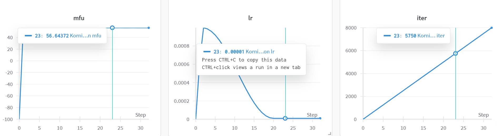
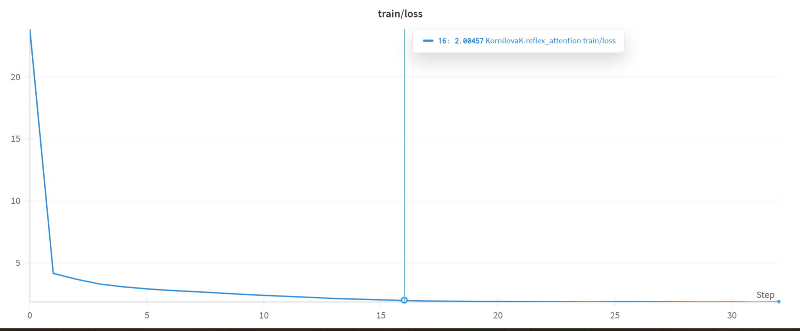
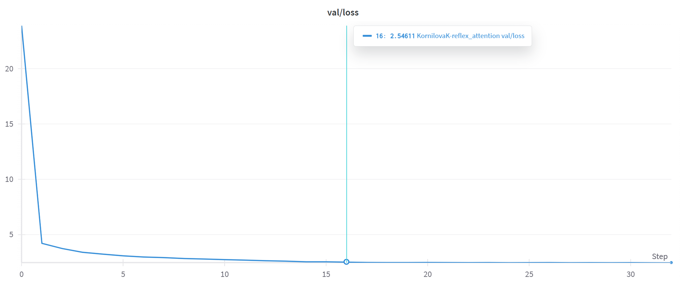

# Reflex Attention
## Обучение модифицированной архитектуры декодера для генерации текста
Based on nanoGPT (GPT-2)

## Idea of Reflex attention
### Классическая архитектура декодера трасформера
Состоит из N последовательных слоев (+ позиционные ембеддинги), каждый слой представляет из себя: нормализация -> блок внимания (+ residual connection) -> нормализация -> FFN (+ residual connection). Механизм внимания распределен на M параллельных голов, что помогает акцентировать внимание на отдельных скрытых компонентах.
В декодере используется маскированный (чтобы не "видеть" будущие токены) self-attention. self-attention считает dot-product между query, key и value (это разные проекции одной входной последовательности). Также существует cross-attention, который считает attention scores, но query берет из исходной последовательности, а key и value из другой.
Генерация токенов авторегрессионная, то есть за один проход по весам модели она генерирует 1 токен, получив на вход исходную последовательность. Чтобы сгенерировать целую последовательность из токенов, необходимо K раз генерировать по 1 новому токену, подавая на вход обновленную последовательность (либо пока не получим eos токен).

### Данный способ уже давно нашел мого методов улучшений
Из основных изменений:
- нормализация: post/pre layer_norm; layer_norm/rms_norm
- функция активации в FFN (линейный слой + функция активации + линейный слой): например, SwiGLU вместо GELU
- позиционные эмбеддинги: вместо асолютных использовать относительные (rotary)
- Также важными улучшениями являются те, что направлены на оптимизацию вычисленния attention, тк эта процедура занимает O(n^2) времени и памяти, и с каждым новым токеном время будет расти, тк последовательность, для которой все вычисляется растет -> KV cache, Flash-attention, модификации внимания (full / bird / ...)

## Мое решение
Заключается в том, что оно включает в себя элементы kv-cache и стремится решить проблему забывания информации:

- На первом слое все головы считают self-attention по текущим хидденам (hidden в данном случае - это query, key, value). Затем на каждом следующем мы выделяем по 1 голове на подсчет cross-attention между текущим query и key, value из предыдущих слоев. Например, модель из 8 голов 6 слоев (на каждом слое сохраняем текущие key и value):
  1 слой) 8 голов на self-attention
  2 слой) 7 голов на self-attention, 1 голова на cross-attention с 1м слоем
  3 слой) 6 голов на self-attention, 1 голова на cross-attention с 2м слоем, 1 голова на cross-attention с 1м слоем
  ...
  6 слой) 3 головы на self-attention, 1 голова на cross-attention с 5м слоем, 1 голова на cross-attention с 4м слоем, 1 голова на cross-attention с 3м слоем, 1 голова на cross-attention с 2м слоем, 1 голова на cross-attention с 1м слоем

- Все головы конкатенируются для дальнейших вычислений
- Из других изменений: использовала Pre RMSNorm и SwiGLU
- Там, где возможно, инициализировала весами [ai-forever/rugpt3large_based_on_gpt2](https://huggingface.co/ai-forever/rugpt3large_based_on_gpt2), использовала этот же токенайзер
- Датасет - [Den4ikAI/russian_instructions_2](https://huggingface.co/datasets/Den4ikAI/russian_instructions_2)
- Из дальнейших улучшений: сделать распределение голов обучаемым, использовать rotary embeddings

## Обучение:
- A100, cuda, в bfloat16
- batch_size = 8
- block_size = 2048
- vocab_size = 50257
- n_layer = 6
- n_head = 8
- n_embd = 1536
- dropout = 0.1
- bias = True
- gradient_accumulation_steps = 2





## Как запустить:
1) Создать виртуальное python окружение, установить все библиотеки ```pip install -r requirements.txt```
2) Загрузить локально веса ```prepare_notebooks/load_model.ipynb```
3) Подготовить датасет ```prepare_notebooks/make_dataset.ipynb```
4) Запустить ```main_notebooks/train_pin_model.ipynb```. **params** лежат в configs! 
5) Протестировать ```main_notebooks/test.ipynb```

Результат [RuGPT-reflex](https://huggingface.co/Eka-Korn/RuGPT-reflex)

### Внимание: работа требует доработки и дообучения
